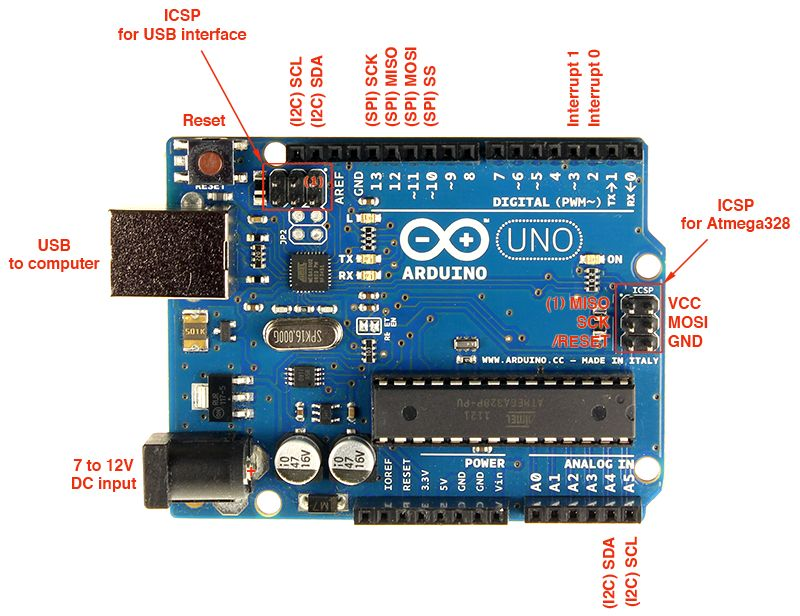
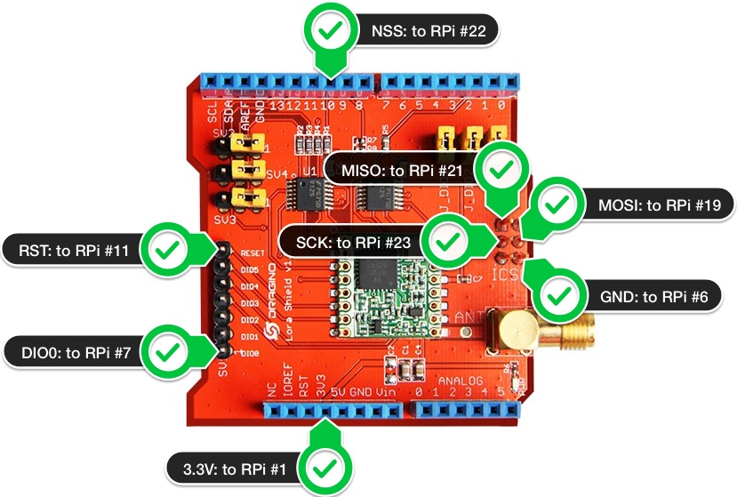
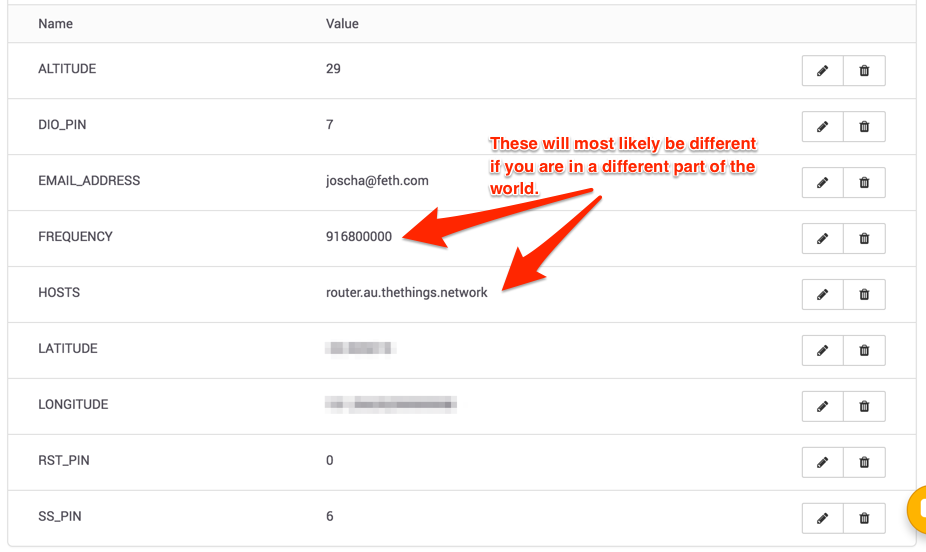

# Resin.io The Things Network Gateway based on Raspberry Pi

This uses a fork of the [Single Channel LoRaWAN Gateway](https://github.com/tftelkamp/single_chan_pkt_fwd) on a Raspberry Pi [as described by Dragino](http://www.instructables.com/id/Use-Lora-Shield-and-RPi-to-Build-a-LoRaWAN-Gateway/) on [resin.io](http://resin.io).


With [resin.io](http://resin.io) you can easily manage multiple gateways on multiple devices remotely and use environment variables (see table at the end of the page) to control each of the device parameters.

## Hardware

It uses a Raspberry Pi Model B+ V1.2 and

* a [Modtronix inAir9](http://modtronix.com/inair9.html) SX1276 LoRa Module

*OR*

* a [Dragino Shield v.1.3](http://wiki.dragino.com/index.php?title=Lora_Shield).

## Default pin mapping:

| Dragino LoRa v 1.3  | inAir9 | Raspberry Pi                                         | WiringPi |
|---------------------|--------|------------------------------------------------------|----------|
| 3.3V                | 3.3V   | [pin #1](http://pinout.xyz/pinout/pin1_3v3_power)    |          |
| ICSP GND            | GND    | [pin #6](http://pinout.xyz/pinout/ground)            |          |
| ICSP MISO           | MISO   | [pin #21](http://pinout.xyz/pinout/pin21_gpio9)      |          |
| ICSP MOSI           | MOSI   | [pin #19](http://pinout.xyz/pinout/pin19_gpio10)     |          |
| ICSP SCK            | SCK    | [pin #23](http://pinout.xyz/pinout/pin23_gpio11)     |          |
| Pin 10              | NSS    | [pin #22](http://pinout.xyz/pinout/pin22_gpio25)     | 6        |
| DIO0                | DIO0   | [pin #7](http://pinout.xyz/pinout/pin7_gpio4)        | 7        |
| RESET               | RST    | [pin #11](http://pinout.xyz/pinout/pin11_gpio17)     | 0        |

### Example
Sorry about the mix & match of different Dupont cables, I didn't have male to female ones available at the time I built this, so be careful with the colors when copying the mapping from the example pictures.

#### Rpi pins

#### inAir9 mapping

#### Both together

#### RPi pin table

#### inAir9 layout

#### Arduino pin layout

#### Dragino 1.3


## Environment variables for resin.io

| Variable name | Value                                                                                 | More info                              |
|---------------|---------------------------------------------------------------------------------------|----------------------------------------|
| DIO_PIN       | 7                                                                                     | Optional. Defaults to 7 (WiringPi pin).|
| RST_PIN       | 0                                                                                     | Optional. Defaults to 0 (WiringPi pin).|
| SS_PIN        | 6                                                                                     | Optional. Defaults to 6 (WiringPi pin).|
| EMAIL_ADDRESS | you@domain.com                                                                        | Optional, empty by default.            |
| FREQUENCY     | [Depends on your location and chip](https://github.com/TheThingsNetwork/gateway-conf) | Optional. In Hz. Defaults to 868100000 |
| HOSTS         | [Depends on your location](https://github.com/TheThingsNetwork/gateway-conf)          | Optional                               |
| LATITUDE      | [Your latitude](http://www.gps-coordinates.net/)                                      | Optional. Float. Defaults to 0.0       |
| LONGITUDE     | [Your longitude](http://www.gps-coordinates.net/)                                     | Optional. Float. Defaults to 0.0       |
| ALTITUDE      | [Your altitude](http://www.gps-coordinates.net/)                                      | Optional. Integer. Defaults to 0       |

### Example


## Client

You should be able to get most of the code from the instructables page (see link in the intro), however I needed to add

```cpp
#define CFG_eu868 0
#define CFG_us915 1
```
and

```
LMIC_setupChannel(0, 916800000, DR_RANGE_MAP(DR_SF12, DR_SF7),  BAND_CENTI);
```

to my sketch to connect to it. You can then read the results from the TTN website (`https://thethingsnetwork.org/api/v0/nodes/<DEVICEID>/`).
